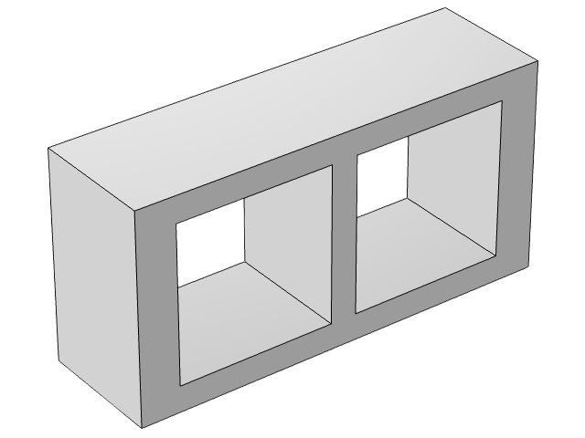
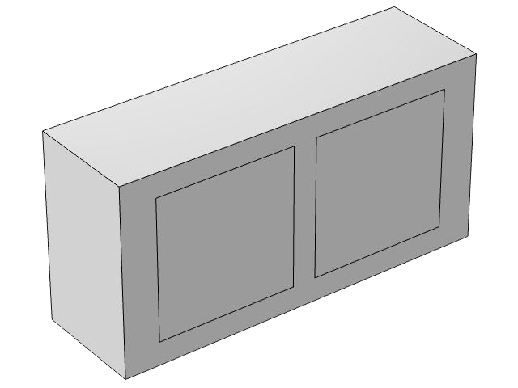
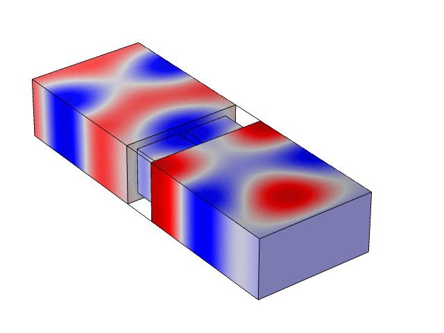
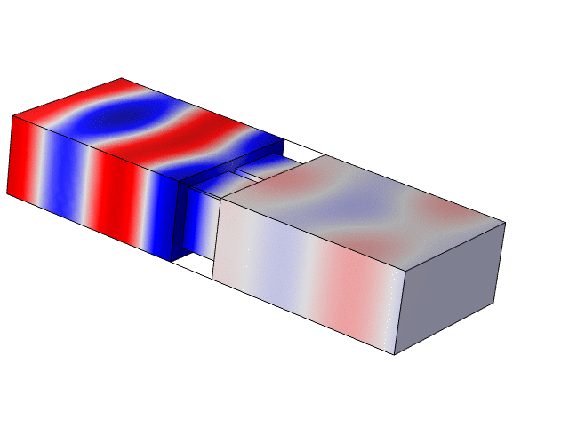
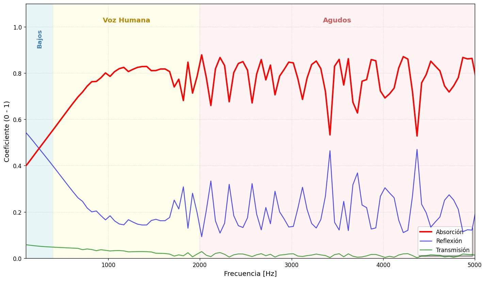
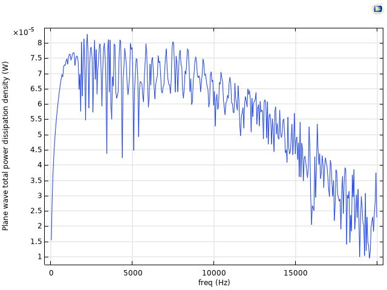
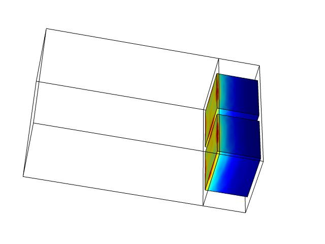

# Acoustic Insulation Analysis: FEA Modeling of Composite Concrete Blocks

This repository documents a Finite Element Analysis (FEA) project developed in **COMSOL Multiphysics** to optimize the acoustic insulation performance of concrete construction blocks through the integration of porous material infills.

##  Engineering Objective
The goal was to enhance the Sound Transmission Loss (STL) and absorption of standard concrete blocks by analyzing the impact of different core materials (Fiber Glass, Polystyrene) using the **Johnson-Champoux-Allard (JCA)** model for porous media.

##  Simulation Methodology
- **Software:** COMSOL Multiphysics (Acoustics Module).
- **Physics Coupling:** Pressure Acoustics coupled with Poroelastic Wave Equations.
- **Material Models:** - **Concrete:** Rigid structure (Sound Hard Boundary).
    - **Fiber Glass / Polystyrene:** JCA model for porous dissipation.

### 1. Structural Design Proposal
 
*Figure 1: Baseline hollow concrete block vs. the proposed composite geometry with internal damping infill.*

### 2. Acoustic Wave Propagation
 
*Figure 2: Comparative wave propagation. The fiber-filled block significantly reduces acoustic energy transmission compared to the hollow baseline.*

##  Performance & Optimization

### Frequency Response (Absorption, Reflection, Transmission)

*Figure 3: Frequency sweep (0-5000 Hz). The composite block exhibits a clear shift in absorption peaks, effectively targeting the human voice and urban noise frequencies.*

### Power Dissipation Density
 
*Figure 4: Power dissipation density analysis. Left: Magnitude of dissipation across the frequency spectrum. Right: Spatial 3D visualization identifying the "hot zones" where the fiber glass converts acoustic kinetic energy into thermal energy.*

##  Key Technical Skills Demonstrated
- **Acoustic FEA:** Expertise in setting up complex frequency-domain studies in COMSOL.
- **Porous Media Modeling:** Implementation of the JCA model to simulate real-world material damping.
- **Optimization Design:** Iterative geometric and material analysis to improve sound transmission loss (STL).

---
*This simulation-driven approach allows for rapid prototyping of sustainable and efficient architectural materials, reducing the need for costly experimental trial-and-error.*
